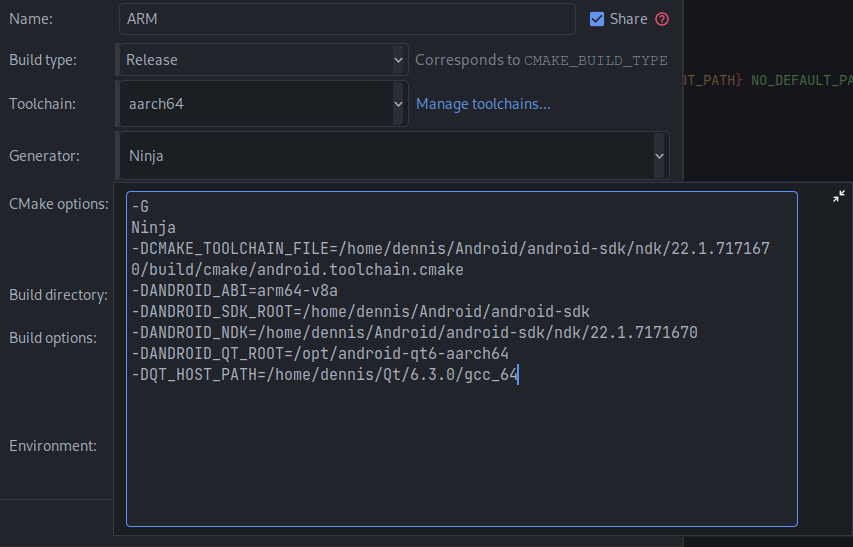

# QT-DeepSudoku

## Prerequisite
Currently only tested with **arm64-v8a** on archlinux with x86-64

- Install [Qt >= 6.3.0 for Android](https://doc-snapshots.qt.io/qt6-dev/android-building.html)
- Install Android [SDK](https://developer.android.com/studio) and [NDK](https://developer.android.com/ndk/downloads) 


- on linux create a udev rule for your mobile device
 ```shell
    usb-devices # get idVendor and idProduct
    echo "SUBSYSTEM==\"usb\", ATTR{idVendor}==\"<yourIDVendor>\", ATTR{idProduct}==\"<yourIDProduct>\", MODE=\"0666\", GROUP=\"plugdev\""  | sudo tee -a /etc/udev/rules.d/51.android.rules
    # add user to plugdev group
    usermod -a -G plugdev <user>
```

## Building

Clone this repository : 

```shell
    git clone --recursive https://github.com/DeepSudoku/QtSudoku.git
```
**ANDROID BUILD**

```shell
    cd QtSudoku
    #shadow build
    mkdir build;cd build

    cmake \
        -G <yourGenerator> \
        -DCMAKE_TOOLCHAIN_FILE=/path-to/android-sdk/ndk/<version>/build/cmake/android.toolchain.cmake \
        -DANDROID_SDK_ROOT=/path-to/android-sdk \
        -DANDROID_NDK=/path-to/ndk/<version> \
        -DANDROID_QT_ROOT=/path-to-qt-android/ \
        -DQT_HOST_PATH=/path-to-qt-host/ \
        -DANDROID_ABI=<your abi> \
        -DCMAKE_BUILD_TYPE=Release ..
```

**DESKTOP BUILD**

The Desktop build currently only works if you have OpenCV installed on your system!

```shell
    cd QtSudoku
    #shadow build
    mkdir build;cd build

    cmake \
        -G <yourGenerator> \
        -DCMAKE_BUILD_TYPE=Debug ..
```

## Running

I generated two CMake profiles using this configuration with [Clion](https://www.jetbrains.com/clion/), one for desktop with a QML engine 
modified to allow hot reloading of QML content whenever you press **<Ctrl + R>**. By doing so, the development 
process can be accelerated.

In the other profile, the final app is generated using the **Android toolchain**. 
Then we launch the `deploy_android.sh` script, which invokes the Qt tool: [androiddeployqt](https://code.qt.io/cgit/qt/qtbase.git/tree/src/tools/androiddeployqt/main.cpp). 

The **binary** directory containing **deployment-settings.json** and the path to the **androiddeployqt** tool are 
required as input parameters. Here is an example of my configuration with Clion:


